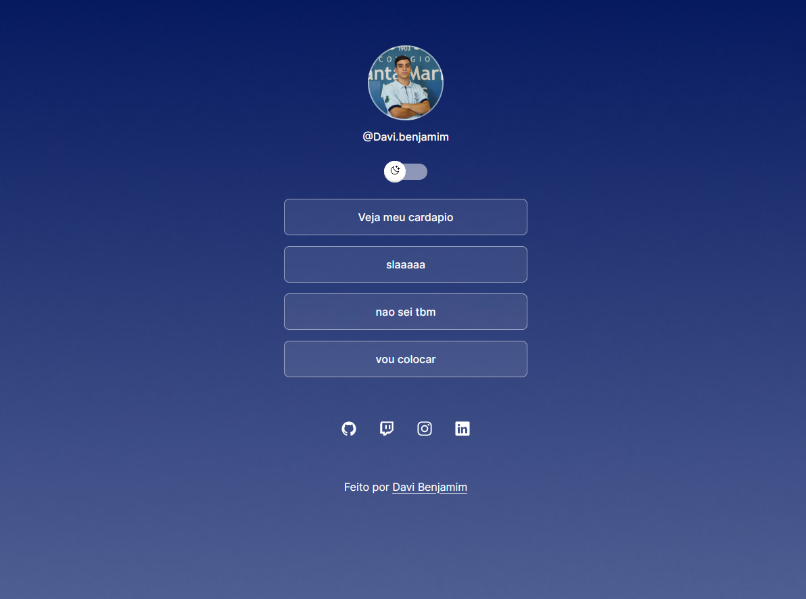

<h1 align="center"> Dav.Links </h1>

Desenvolvi a partir do curso da Rocketseat.  

  <a href="#-tecnologias">Tecnologias</a>&nbsp;&nbsp;&nbsp;|&nbsp;&nbsp;&nbsp;
  <a href="#-projeto">Projeto</a>&nbsp;&nbsp;&nbsp;|&nbsp;&nbsp;&nbsp;

 

  

## 🚀 Tecnologias

Esse projeto foi desenvolvido com as seguintes tecnologias:

- HTML e CSS
- JavaScript
- Git e Github
- Figma

## 💻 Projeto

O Dav.Links é um agregador de links para usar como cartão de visitas online.

<<<<<<< HEAD
- [Acesse o projeto finalizado, online]( https://artmix532.github.io/Dav.Links/)
=======
- [Acesse o projeto finalizado, online](https://artmix532.github.io/Dav.Links/)
>>>>>>> fb0fe932f05715d1f0009bacc7c2266fadcddb6c

---

Feito por Davi Benjamim Guimarâes.
